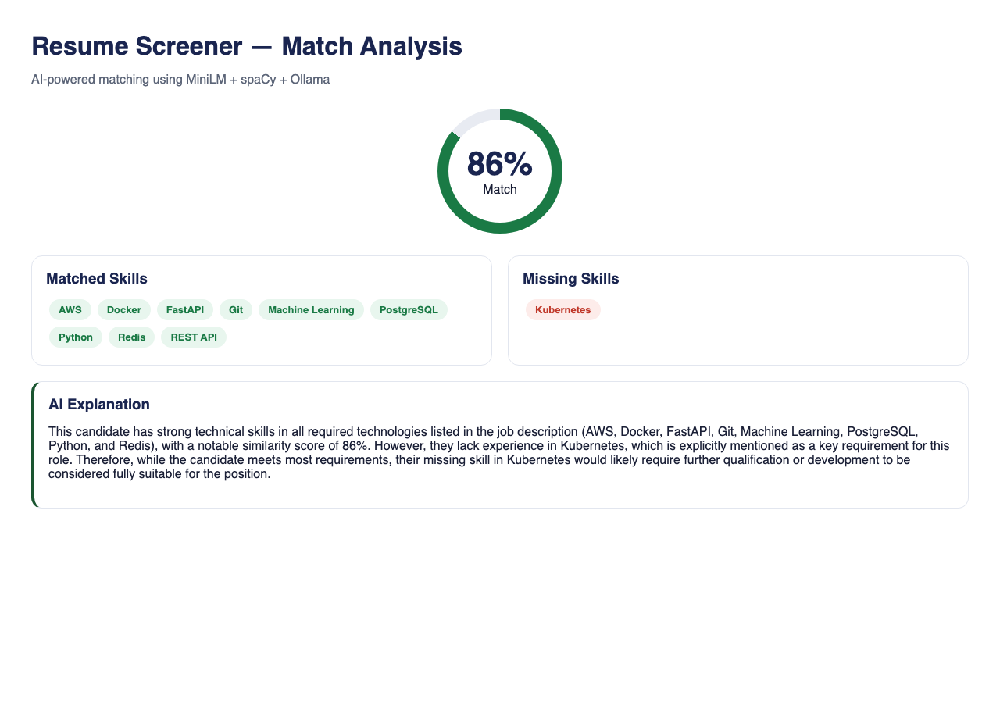

# Resume Screener

AI-powered resume screening using MiniLM + spaCy + ChromaDB + Ollama

## How it works

1. Upload resume PDF or paste resume text
2. Paste job description
3. MiniLM embeds both texts into vectors
4. Cosine similarity computes match score
5. spaCy extracts and compares skills
6. Ollama explains the match in plain English

## Stack

- MiniLM (sentence-transformers) — text embeddings
- spaCy — skill extraction
- ChromaDB — vector storage
- Ollama qwen2.5:3b — match explanation
- FastAPI — REST API
- Pure HTML/CSS/JS — frontend UI

## Run locally

```bash
pip install -r requirements.txt
python -m spacy download en_core_web_sm
./start.sh
# or: uvicorn main:app --port 8010
```

Open http://localhost:8010

## Demo

### Upload UI

Upload a resume PDF and paste a job description, then click **Screen Resume**.


### Match analysis (real run — 86%)

Score circle, matched vs missing skills, and Ollama explanation from a live `/screen-text` call.



### Sample Output

```json
{
  "match_percentage": 86,
  "matched_skills": ["AWS", "Docker", "FastAPI", "Git", "Machine Learning", "PostgreSQL", "Python", "Redis", "REST API"],
  "missing_skills": ["Kubernetes"],
  "explanation": "Strong technical skills across required technologies; only Kubernetes is missing from the JD nice-to-have / gap list."
}
```

## API Endpoints

- `POST /screen` — upload PDF resume + job description
- `POST /screen-text` — paste resume text + job description
- `GET /health` — health check

## Docs

- Full write-up: [`docs/PROJECT_DOCUMENTATION.md`](docs/PROJECT_DOCUMENTATION.md)
- Test results: [`docs/TEST_RESULTS.md`](docs/TEST_RESULTS.md)
